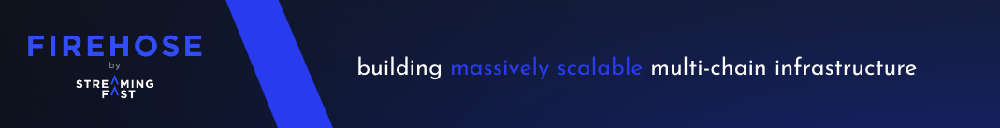

# Firehose for Ethereum

Quick start with Firehose for Ethereum can be found in the official Firehose docs. Here some quick links to it:

- [Firehose Overview](https://firehose.streamingfast.io/introduction/firehose-overview)
- [Concepts & Architectures](https://firehose.streamingfast.io/concepts-and-architeceture)
  - [Components](https://firehose.streamingfast.io/concepts-and-architeceture/components)
  - [Data Flow](https://firehose.streamingfast.io/concepts-and-architeceture/data-flow)
  - [Data Storage](https://firehose.streamingfast.io/concepts-and-architeceture/data-storage)
  - [Design Principles](https://firehose.streamingfast.io/concepts-and-architeceture/design-principles)
- [Ethereum Syncing](https://firehose.streamingfast.io/firehose-setup/ethereum)

## Release

Use the `./bin/release.sh` Bash script to perform a new release. It will ask you questions
as well as driving all the required commands, performing the necessary operation automatically.
The Bash script runs in dry-mode by default, so you can check first that everything is all right.

Releases are performed using [goreleaser](https://goreleaser.com/) and specifically [goreleaser-cross](https://github.com/goreleaser/goreleaser-cross).

## Docker Bundle Image Building

New version of Ethereum clients means releasing a new version of the full bundled image of `firehose-ethereum` that contains `fireeth` binary as well as node instrumented binary to sync with the chain. Doing this is really simple as we will simply ask GitHub to launch an action that will build for us the bundled image with the current up to date version of the Ethereum client.

First, install the [GitHub CLI](https://github.com/cli/cli#github-cli) and configure it to be connected with your account.

Run the following commands:

- Release latest official release with Firehose V2 Instrumentation: `gh workflow run docker.yml -f geth_version=fh2 --ref v1.2.2`
- Release trunk `develop` with Firehose V2 Instrumentation (development builds): `gh workflow run docker.yml -f geth_version=fh2 --ref develop`

## Contributing

**Issues and PR in this repo related strictly to the Ethereum on StreamingFast.**

Report any protocol-specific issues in their
[respective repositories](https://github.com/streamingfast/streamingfast#protocols)

**Please first refer to the general
[StreamingFast contribution guide](https://github.com/streamingfast/streamingfast/blob/master/CONTRIBUTING.md)**,
if you wish to contribute to this code base.

This codebase uses unit tests extensively, please write and run tests.

## License

[Apache 2.0](LICENSE)
